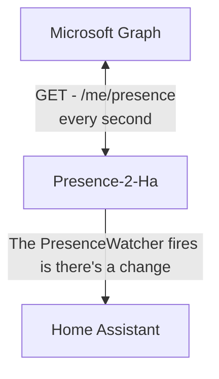
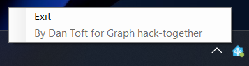

# Presence to Home Assistant

[](https://github.com/microsoft/hack-together)

## The problem we're solving
You know that moment where you're in an important teams meeting and suddenly someone comes crashing into your office to talk to you? - well what if they could tell that you were in a meeting before they even open the door?

Using Microsoft Graph and Home Assistant they could!

See it in action here
[](https://www.youtube.com/watch?v=v89xS8rHM74)

---

## The solution?
Outside the door to my office i have an [Ikea Fado](https://www.ikea.com/dk/da/p/fado-bordlampe-hvid-80096372/) with a zigbee color bulb inside - that I control using Home Assistant.

This is great because it means I have now have a nice API I can call to control the lamp!

Now to get my presence, here there's three options

- /me/presence
- Teams presence webhook
- The teams clients websocket - this would also work great but is currently removed for security reasons. (See an implementation [here](https://github.com/svrooij/teams-monitor))

I went for the /me/presence endpoint, for a few reasons:

- The Teams presence webhook is only available under the beta endpoint [(for now)](https://learn.microsoft.com/en-us/graph/api/resources/webhooks?view=graph-rest-1.0) - and I've found the webhooks to sometimes be a bit too slow for what I want here.
- My Smart home system is only available on my local network, not externally, so I would need a proxy setup on my own network, and that sounds like a lot of work.
- I only want the light to be controlled when I'm using the computer, I would like to be able to control my lights myself whiles't not at work.
- I actually have the required permissions to set this up on my workplaces tenant!

Now there are some drawbacks to this approach

- You're really supposed to use the webhook approach.
- **Throttling!** - the code here pulls from Graph every second, you could change this to 5, 10 or even 30 seconds without too much worry.
- You have to have an app running on your machine

That means the "overview" of the solution looks something like this



Initially I set it up as a console job, but found I kept on closing it accidentally, so I decided on a tray icon ... I had never built any apps that run in the notification tray, but it was relatively easy, with the only problem being the tray part makes the app Windows only - should be somewhat convertible to any other platform with a bit of tinkering.



## Features

- Turn the light on once you start the program.
- Change the color based on your presence (Green, Yellow, Red or Grey).
- Turn the bulb back off after you close the program.
- Built to be customizable, the code is built such that you can built your own code to run - could easily be updated to control more lights.

---

## Setup

### Graph
Now when interacting with Graph we need an app registrations, with the following permissions

- Presence.Read | Delegated
- User.Read | Delegated

Grab your ClientId and TenantId - we'll need those later!

### Home assistant
From home assistant we need a few things as well

- Your HA url - something like 192.168.1.xxx:8123
- The entity name of the light you want to control (i.e. 'light.fado')
- A long lived token (Go to your profile, scroll to the bottom, and click create token)

---
Once you've gathered those variables they should be passed as arguments to the TrayIcon project, like here

```
TrayIcon.exe <ClientId> <TenantId> <HA Url> <HA Token> <HA Entry name>
```

Here is a video of starting and exiting the job


---

## Room for improvement

There is loads of ways to improve this solution, feel free to submit a PR if you want to help out

- Error handling (both on the HA and Graph Side)
- Updating icon based on presence
- Use websocket once it's available
- Non-windows support
- Better configuration (maybe a GUI to fill the variables)